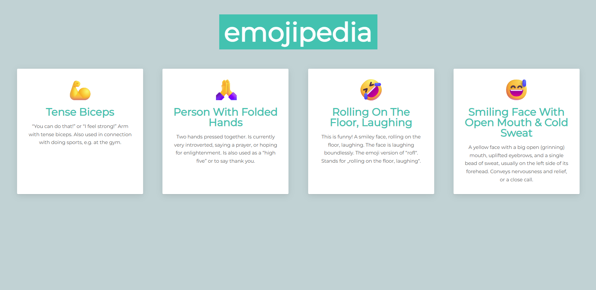

# 📒 Emojipedia

A simple React app built with **Vite** that displays a list of emojis with their names and meanings.  
This project was created as part of my React learning journey.

---

## 🚀 Features
- Built with **React + Vite** for fast development.
- Uses **components** to render reusable UI.
- Displays emoji entries from a separate data file (`emojipedia.js`).
- Easily extendable, you can add more emojis by editing `emojipedia.js`.
- Clean and minimal design.

---

## 📂 Project Structure

```
emojipedia/
├── public/               # Static assets
├── src/
│   ├── components/
│   │   ├── App.jsx       # Main app component
│   │   ├── Entry.jsx     # Single emoji entry component
│   ├── emojipedia.js     # Emoji data source
│   ├── index.jsx         # Entry point
├── package.json
├── package-lock.json
├── vite.config.js
```

---

## 🛠️ Installation & Setup

Clone this repository and install dependencies:

```bash
git clone https://github.com/Thejanu/emojipedia.git
cd emojipedia
npm install
```

Start the development server:

```bash
npm run dev
```

The app will be running at **http://localhost:5173** (default Vite port).

---

## 📸 Preview

  


---

## 📖 Usage

The app maps through the `emojipedia.js` array and renders each emoji inside the `Entry` component.

Example entry from `emojipedia.js`:

```js
{
  id: 1,
  emoji: "💪",
  name: "Tense Biceps",
  meaning: "“You can do that!” or “I feel strong!”..."
}
```

➡️ To add more emojis, simply add new objects to the `emojipedia.js` array.

---

## 🧑‍💻 Technologies Used
- [React](https://reactjs.org/)
- [Vite](https://vitejs.dev/)

---

## 📜 License
This project is for learning purposes. Feel free to use or modify it.
